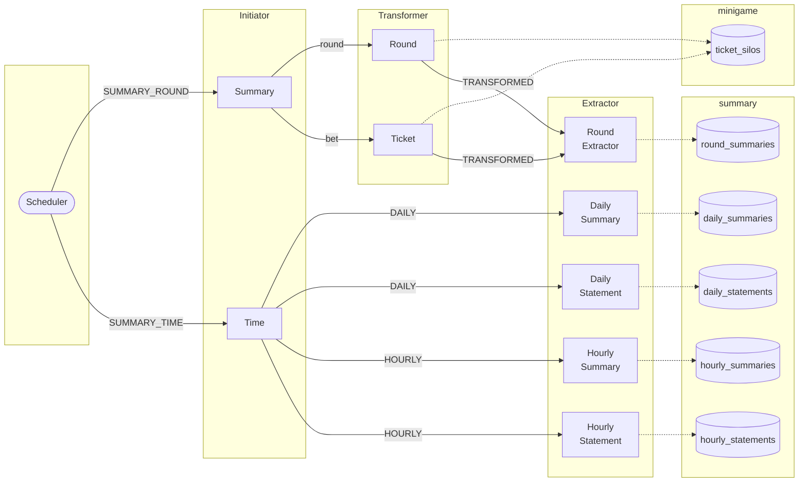
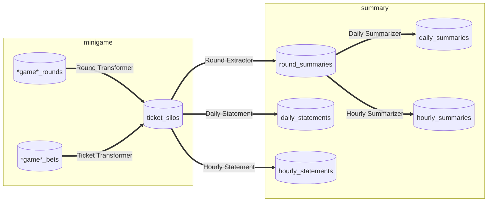

## db-data-summaries-service

### Components

```mermaid
flowchart LR
    subgraph Scheduler[ ]
        S([Scheduler])
    end

    subgraph Initiator
        SI[Summary] & TI[Time]
    end

    subgraph Transformer
        RT[Round] & TT[Ticket]
    end

    subgraph Extractor
        RE[Round\nExtractor]
        DSum[Daily\nSummary] & HSum[Hourly\nSummary]
        DSt[Daily\nStatement] & HSt[Hourly\nStatement]
    end

    subgraph minigame
        TS_DB[(ticket_silos)]
    end

    subgraph summary
        RSum_DB[(round_summaries)]
        DSum_DB[(daily_summaries)]
        HSum_DB[(hourly_summaries)]
        DSt_DB[(daily_statements)]
        HSt_DB[(hourly_statements)]
    end

    S -->|SUMMARY_ROUND| SI
    S -->|SUMMARY_TIME| TI

    RT & TT -..-> TS_DB
    SI -->|round| RT
    SI -->|bet| TT

    TI -->|DAILY| DSum & DSt
    TI -->|HOURLY| HSum & HSt

    RT & TT -->|TRANSFORMED| RE -.-> RSum_DB
    DSum -.-> DSum_DB
    HSum -.-> HSum_DB
    DSt -.-> DSt_DB
    HSt -.-> HSt_DB
```
### Data flow

```mermaid
flowchart LR
    subgraph minigame
        R_DB[(*game*_rounds)]
        B_DB[(*game*_bets)]
        TS_DB[(ticket_silos)]
    end

    subgraph summary
        RSum_DB[(round_summaries)]
        DSum_DB[(daily_summaries)]
        HSum_DB[(hourly_summaries)]
        DSt_DB[(daily_statements)]
        HSt_DB[(hourly_statements)]
    end

    R_DB ==>|Round Transformer| TS_DB
    B_DB ==>|Ticket Transformer| TS_DB
    TS_DB ==>|Round Extractor| RSum_DB
    TS_DB ==>|Daily Statement| DSt_DB
    TS_DB ==>|Hourly Statement| HSt_DB
    RSum_DB ==>|Daily Summarizer| DSum_DB
    RSum_DB ==>|Hourly Summarizer| HSum_DB
```
